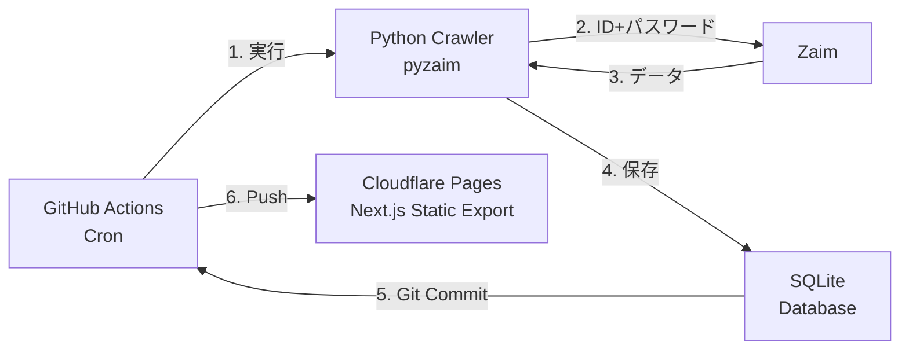

<div align="center">
  
  <h1>Zaim Dashboard</h1>
  <p>Zaimの家計データを自動取得・可視化するダッシュボード</p>
</div>

## 機能

- **収支の可視化** — 月別・カテゴリ別に収入・支出をグラフ表示
- **取引一覧** — キーワード・カテゴリ・種別でフィルタリング可能
- **自動データ取得** — GitHub Actions で毎日 Zaim からデータを自動取得

## アーキテクチャ



**処理の流れ:**

1. GitHub Actions の cron スケジュールで自動実行（毎日 JST 7:00）
2. `crawler/fetch_zaim.py` が pyzaim を使って Zaim にログイン
3. 直近 3 ヶ月分のデータを取得し `data/zaim.db`（SQLite）に保存
4. DB ファイルをリポジトリにコミット → Cloudflare Pages がビルド・公開

## セットアップ

### GitHub Secrets の設定

リポジトリの **Settings → Secrets and variables** に追加：

| 種別 | キー | 値 |
|------|------|----|
| Secret | `ZAIM_ID` | Zaim のログイン ID |
| Secret | `ZAIM_PASSWORD` | Zaim のパスワード |
| Variable | `RUN_TASK` | `true` |
| Variable | `FETCH_MONTHS` | `3`（取得する月数、省略可） |

### ローカル開発

```sh
git clone https://github.com/seadoon/my-money-dashboard
cd my-money-dashboard
pnpm i

# デモデータで確認
pnpm dev:demo

# 実データを取得する場合（要 Python + pyzaim）
pip install -r crawler/requirements.txt
ZAIM_ID=xxx ZAIM_PASSWORD=yyy python3 crawler/fetch_zaim.py
pnpm dev
```

## 推奨セキュリティ

- Cloudflare One でサイトへのアクセス制限（Google ログイン等）
- GitHub リポジトリは Private に設定
